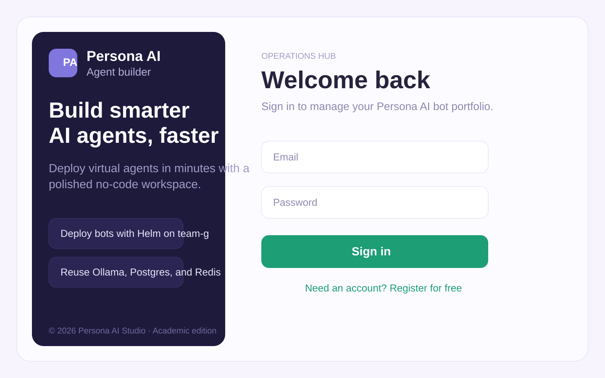
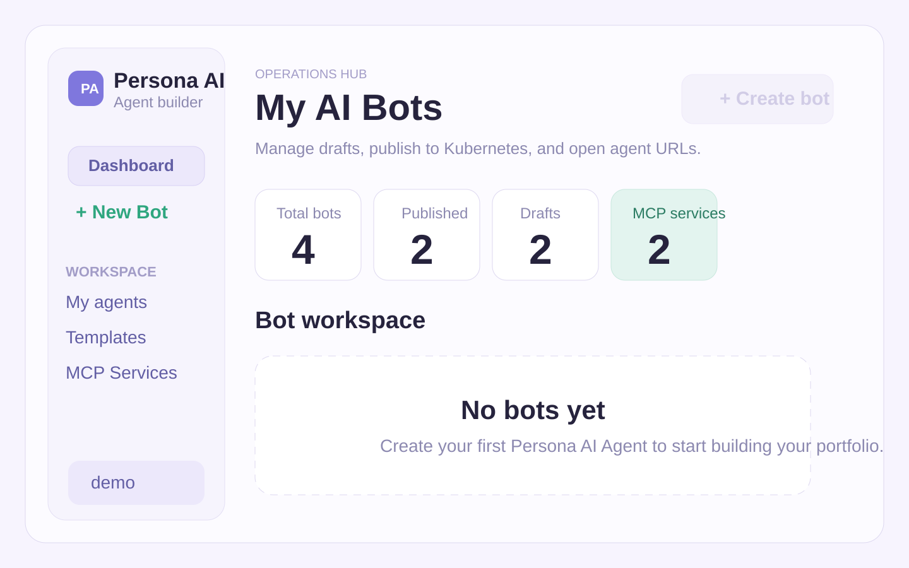
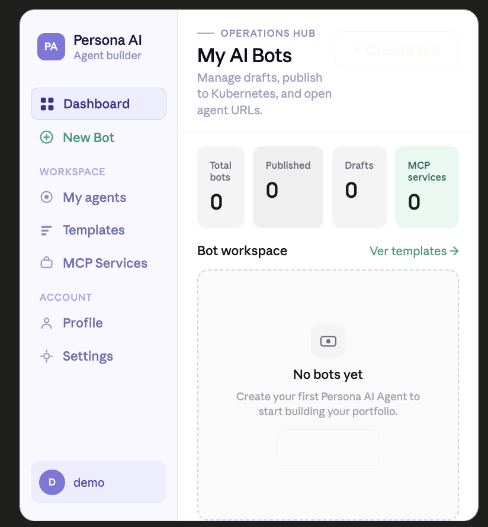

# Persona AI Agent Creator

Academic full-stack platform for the Verana EAFIT challenge. The repository now includes a complete Step 3 implementation for creating, configuring, and publishing Persona AI Agents through a responsive web interface inspired by the provided references.

## What was implemented

- React + Vite frontend with responsive login, dashboard, bot creation, and bot detail pages.
- Express backend with:
  - registration, login, logout
  - bot CRUD
  - file upload support for persona images and RAG documents
  - publish / unpublish flow with Helm asset generation
- Shared-infra deployment model aligned with the academic constraints:
  - single namespace: `team-g`
  - single environment
  - shared Ollama, Redis, and Postgres
  - one Postgres schema per published bot
- Two functional MCP integrations exposed by the platform:
  - Weather via Open-Meteo
  - Wikipedia via Wikimedia APIs
- Dockerfile, Helm chart, and GitHub Actions workflow for automatic deployment.

## Interface

Login view:



Dashboard view:



Reference dashboard from the design brief:



## Repository highlights

- [web-app/package.json](web-app/package.json)
- [web-app/server/index.js](web-app/server/index.js)
- [web-app/server/routes/bots.js](web-app/server/routes/bots.js)
- [web-app/server/services/deployment.js](web-app/server/services/deployment.js)
- [web-app/helm/persona-ai-creator/values.yaml](web-app/helm/persona-ai-creator/values.yaml)
- [.github/workflows/deploy.yml](.github/workflows/deploy.yml)

## MCP integrations

### 1. Weather MCP

- Endpoint: `GET /api/mcp/weather/demo?location=Medellin`
- Purpose: allows bots to inspect current weather conditions before recommending or scheduling outdoor activities.
- Data source: Open-Meteo geocoding + forecast APIs.

### 2. Wikipedia MCP

- Endpoint: `GET /api/mcp/wikipedia/demo?q=Verana`
- Purpose: gives bots an external knowledge lookup service for general questions.
- Data source: Wikimedia title search + page summary APIs.

## Local setup

1. Go to the web app folder:

```bash
cd web-app
```

2. Create your environment file:

```bash
cp .env.example .env
```

3. If you want real bot publishing from the app, save the provided kubeconfig into `web-app/secrets/team-g-kubeconfig.yaml` and update:

```env
ENABLE_HELM_DEPLOY=true
KUBECONFIG_PATH=./secrets/team-g-kubeconfig.yaml
MCP_PUBLIC_BASE_URL=http://localhost:4000
```

4. Install dependencies:

```bash
npm install
```

5. Run the platform:

```bash
npm run dev
```

6. Open:

- Frontend: `http://localhost:5173`
- Backend: `http://127.0.0.1:4000`

## Local verification flow

1. Register a user in the login screen.
2. Create a new bot with persona, service, prompt, MCP services, and optional files.
3. Save the bot.
4. Publish it.
5. Check generated assets in:

```bash
web-app/generated/<bot-slug>/
```

When `ENABLE_HELM_DEPLOY=false`, publishing works as a dry-run and still generates the agent pack and Helm values.

## Kubernetes deployment with GitHub Actions

### Required GitHub secrets

- `DOCKERHUB_USERNAME`
- `DOCKERHUB_TOKEN`
- `KUBE_CONFIG`
- `APP_JWT_SECRET`
- `SHARED_POSTGRES_PASSWORD`

### Deployment flow

1. Create a Docker Hub repository such as `your-user/eafit-persona-agent-creator`.
2. Update the default image repository in [web-app/helm/persona-ai-creator/values.yaml](web-app/helm/persona-ai-creator/values.yaml) if needed.
3. Push to `main`.
4. GitHub Actions will:
   - build the image
   - push `latest` and `${sha}` tags
   - decode the kubeconfig secret
   - run `helm upgrade --install` in namespace `team-g`
   - deploy the shared `postgres`, `redis-master`, and `ollama` services used by every bot

## Manual Kubernetes test

From your machine, once your kubeconfig is available:

```bash
cd web-app
helm upgrade --install persona-ai-creator ./helm/persona-ai-creator \
  --namespace team-g \
  --create-namespace \
  --set image.repository=your-user/eafit-persona-agent-creator \
  --set image.tag=latest \
  --set appSecrets.jwtSecret=change-me \
  --set appSecrets.sharedPostgresPassword=change-me \
  --set-file appSecrets.kubeconfig=./secrets/team-g-kubeconfig.yaml
```

After the platform is up, each bot publish will:

- create or reuse its own schema inside shared Postgres
- point chatbot memory/vector storage to shared Redis
- send LLM traffic to the shared Ollama service using the OpenAI-compatible `/v1` API

## Architecture

See [web-app/docs/architecture.md](web-app/docs/architecture.md).

## Notes

- The previous example-agent deployment workflow was preserved as [example-agent.yml](.github/workflows/example-agent.yml).
- Runtime bot publishing uses environment-driven URLs, so set `MCP_PUBLIC_BASE_URL` to the public address of the platform once deployed.
