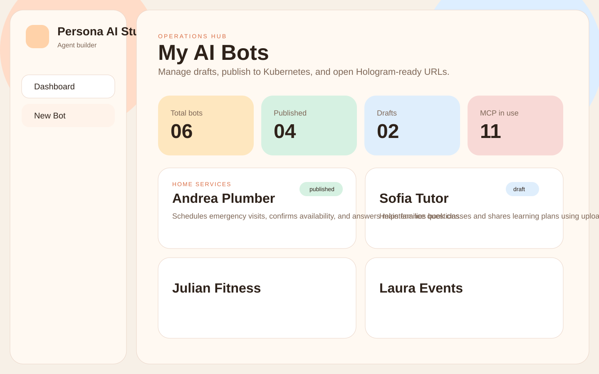
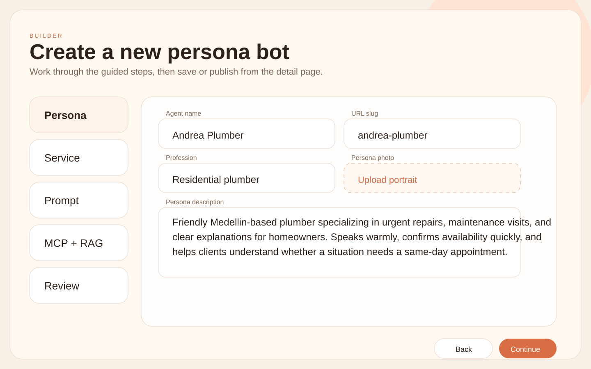

# Persona AI Studio — User Guide

Persona AI Studio lets non-technical users create and manage AI agents that represent real professionals.

## Main flow

1. Register or log in
2. Open `New Bot`
3. Complete the guided steps:
   - Persona
   - Service
   - Prompt
   - MCP + RAG
   - Review
4. Save the bot
5. Open the bot detail page
6. Click `Publish`
7. Open the generated public URL in Hologram

## What you can configure

### Persona attributes

- Name
- Profession
- Persona description
- Photo

### Service attributes

- Service name
- Service description
- Service category

### Prompt

Use the prompt editor to define:

- Tone of voice
- Boundaries
- Sales style
- Escalation rules
- Scheduling instructions

### MCP services

The platform includes two selectable MCP integrations:

- `Weather Planner`
  - Checks weather conditions for a location
  - Helps decide whether an outdoor appointment should go ahead
- `Wikipedia Research`
  - Searches Wikipedia
  - Reads page summaries for general knowledge support

### RAG

Upload reference files such as:

- PDFs
- Service brochures
- Pricing sheets
- FAQs
- Internal notes

Those files are stored and then added to the generated agent-pack as remote RAG sources.

## Dashboard actions

Each bot card supports:

- `Open`
- `Edit`
- `Publish`
- `Unpublish`
- `Delete`

Published bots display a public URL button.

## Publish behavior

When you publish a bot, the platform:

1. Generates deployment artifacts
2. Assigns a URL in this format:
   `<agentname>.agents.<team_name>.teams.eafit.testnet.verana.network`
3. Optionally executes Helm against your Kubernetes cluster if it is enabled in `.env`

## Screens

Dashboard:

Bot builder:

## Troubleshooting

| Problem | What to check |
| --- | --- |
| Publish fails | Verify `KUBECONFIG_PATH`, `K8S_NAMESPACE`, and `ENABLE_K8S_APPLY` |
| Public URL not opening | Confirm your ingress / DNS configuration in the cluster |
| File uploads fail | Check that the server can write to `web-app/server/uploads/` |
| MCP server is unavailable | Make sure the backend is reachable from the deployed bot URL |
