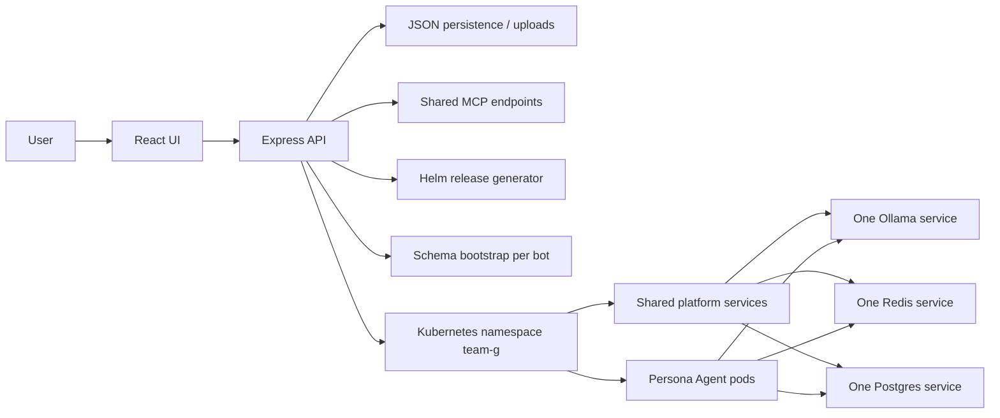

# Architecture

## Notes

- The platform runs as a single web application deployed in the academic namespace `team-g`.
- Bot publishing is generated from the UI and executed with Helm using shared infra services.
- Each bot should use a dedicated schema inside the shared Postgres instance, not a dedicated Postgres server.
- Chatbot pods talk to Ollama through its OpenAI-compatible `/v1` endpoint, so no real OpenAI account is required.
- Generated per-bot assets are written to `web-app/generated/<slug>/`.
